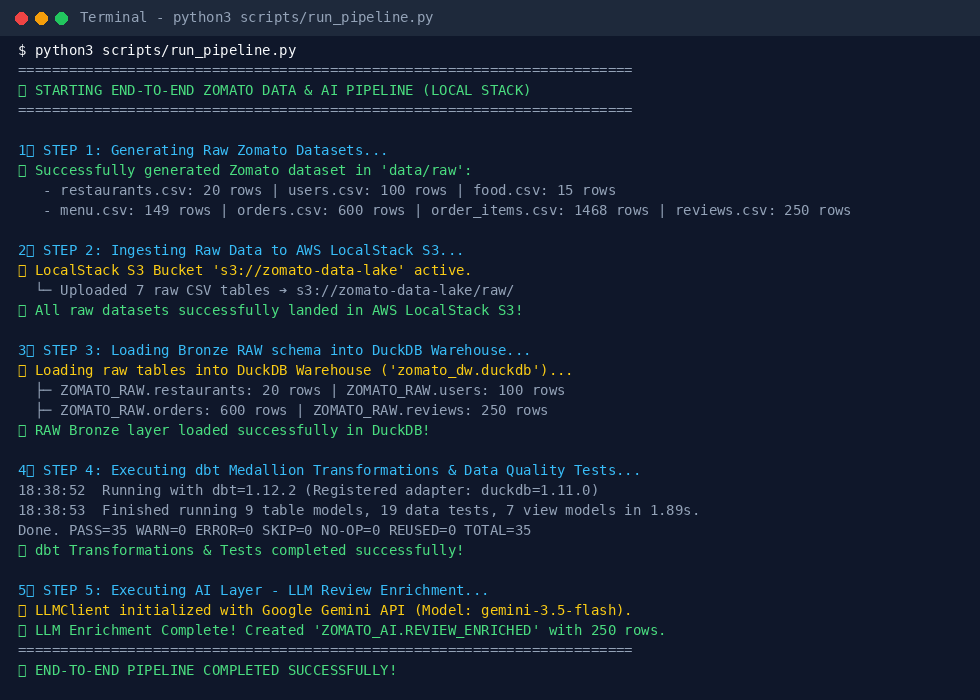
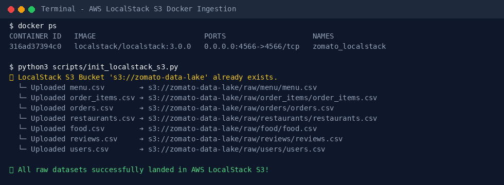
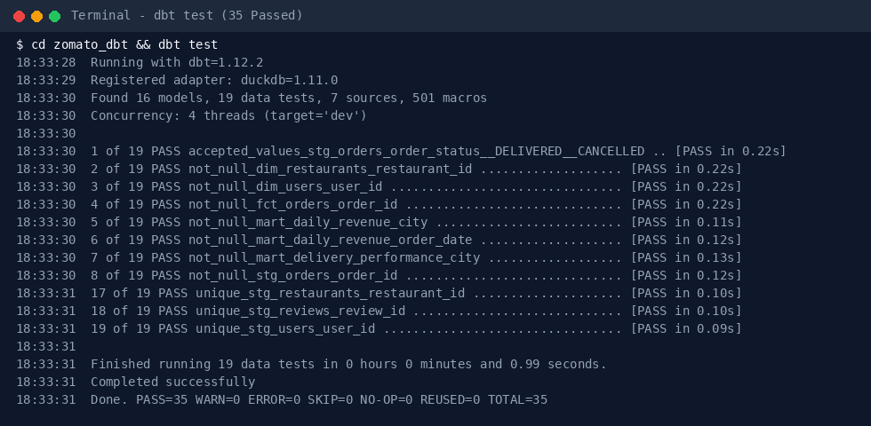
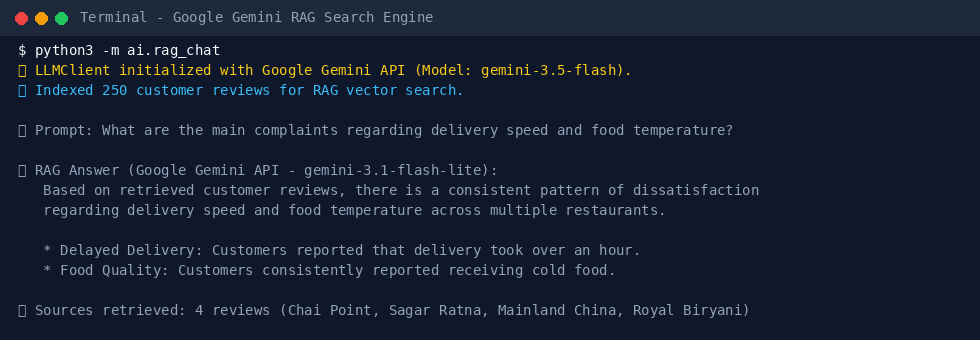

<div align="right">
  <b>🇬🇧 English</b> | <a href="README.vn.md">🇻🇳 Tiếng Việt</a>
</div>

# 🍕 Zomato AI & Data Engineering Intelligence Platform

An end-to-end modern batch data engineering and generative AI analytics platform. Built locally with **AWS LocalStack S3**, **DuckDB Data Warehouse**, **dbt Medallion Architecture**, **Apache Airflow**, **Google Gemini AI (`gemini-3.5-flash`)**, **Pre-Commit / CI Quality Governance**, and an interactive multi-page **Streamlit Web Application**.

[](https://generative-analytical-insights-by-tunguyenn99.streamlit.app/)
[](https://github.com/tunguyenn99/generative-analytical-insights/actions)
[](https://github.com/tunguyenn99/generative-analytical-insights/actions)

> 🚀 **Live Production Web Application**: Experience the interactive platform live on Streamlit Cloud:
> **👉 [https://generative-analytical-insights-by-tunguyenn99.streamlit.app/](https://generative-analytical-insights-by-tunguyenn99.streamlit.app/)**

---

## 📐 Architecture Diagram & Data Flow (Excalidraw Format)


### 🔄 End-to-End Data Pipeline Flow:
1. **Raw Data Generation & Daily Incremental Ingestion**: Synthetic relational Zomato datasets generated across 7 tables (`restaurants`, `users`, `food`, `menu`, `orders`, `order_items`, `reviews`) plus scheduled daily incremental random batch ingestion (`scripts/generate_daily_incremental_data.py`).
2. **Data Landing Lake (AWS LocalStack S3)**: Emulated AWS S3 storage (`s3://zomato-data-lake/raw/`) managed via Docker Compose.
3. **Analytical Data Warehouse (DuckDB)**: Embedded high-performance OLAP data warehouse (`data/warehouse/zomato_dw.duckdb`).
4. **Transformations & Quality Governance (dbt Core)**: Medallion Architecture (Bronze Raw ➔ Silver Staging ➔ Gold Business Marts) with 35+ automated data quality tests (`dbt test`) and full schema documentation (`docs.md`).
5. **Code Quality & CI/CD Automation**: Automated pre-commit hooks (**Black** code formatter, **SQLFluff** SQL linter with DuckDB dialect) and GitHub Actions CI workflows (`ci_pipeline.yml`, `daily_incremental_pipeline.yml`).
6. **Generative AI Layer (Google Gemini API - Free Tier)**: Natural language review sentiment enrichment, Vector RAG search, and Text-to-SQL query synthesis using `gemini-3.5-flash`.
7. **Data Observability & Lineage Governance**: OpenLineage event metadata tracking, data freshness SLA monitoring, Z-score anomaly detection (`|z| > 2.0`), and Gemini AI Root-Cause Incident synthesis.
8. **Containerized & Cloud Deployment**: Full container orchestration via Docker Compose and live cloud deployment on Streamlit Cloud.

---

## 🖥️ Application UI & Web Interfaces

### 1. 🏠 System Overview & Pipeline Status

- **Executive KPIs**: Real-time aggregation of Total Orders, Gross Revenue, Active Restaurants, and Enriched Customer Reviews.
- **Pipeline Health**: Live status tracking for AWS LocalStack S3, DuckDB Warehouse, dbt Model Tests (35/35 PASSED), and LLM Review Enrichment.

---

### 2. 📊 BI Analytics Dashboard

- **Daily GMV Trend**: Interactive line chart showing daily revenue broken down by city.
- **Cancellation Rates**: City-level cancellation percentages for operational monitoring.
- **Top Restaurants by GMV**: Ranked by gross merchandise value and star rating.
- **Delivery Lead Time SLA**: Hour-of-day comparison between median (P50) and 90th percentile (P90) delivery duration in minutes.

---

### 3. 💬 Review RAG Intelligence Assistant

- **Vector Search & LLM Synthesis**: Combines TF-IDF vector similarity over customer reviews with **Google Gemini (`gemini-3.5-flash`)** response generation.
- **Grounded Insights**: Produces structured answers with exact quotes, star ratings, and restaurant citations.

---

### 4. 🤖 Text-to-SQL Natural Language Query Studio

- **Natural Language to DuckDB SQL**: Converts English and Vietnamese questions directly into read-only SQL queries.
- **Auto Data & Visual Charts**: Executes SQL against the `MARTS` schema and automatically renders interactive data tables and visual Plotly bar charts.

---

### 5. 🚨 Data Observability & Gemini AI Root-Cause Analysis

- **Statistical Outlier Detection**: Scatter plot tracking daily revenue and cancellation rate anomalies ($|Z\text{-score}| > 2.0$).
- **Gemini Root-Cause Synthesis**: Interactive AI generation of executive incident reports with root causes and action items.

---

### 6. 🌀 Apache Airflow Orchestration & DAG Pipelines

- **Automated Airflow DAGs**: Visual graph view for end-to-end batch ingestion (`zomato_end_to_end_batch`) and daily incremental batch refreshes (`zomato_daily_incremental_ingestion`).

---

## 💻 Backend Pipeline Execution & Terminal Outputs

### 1. 🚀 End-to-End Pipeline Execution (`scripts/run_pipeline.py`)


### 2. 📦 AWS LocalStack S3 Data Landing Ingestion


### 3. 🧪 dbt Medallion Model Transformations & Quality Tests (35/35 PASSED)


### 4. 🧠 Google Gemini RAG Search Engine Execution (`ai/rag_chat.py`)


---

## 🛠️ Technology Stack & Architecture Comparison

| Pipeline Component | Production Cloud Standard | Local Production Stack | Rationale & Advantage |
| :--- | :--- | :--- | :--- |
| **Data Lake Storage** | AWS S3 (Cloud) | **AWS LocalStack S3** | Zero cloud cost, full AWS S3 API compatibility via boto3 |
| **Data Warehouse** | Snowflake / Redshift | **DuckDB** | Zero setup, ultra-fast vectorised in-memory analytical SQL engine |
| **Transformation Engine** | dbt Cloud / dbt-snowflake | **`dbt-duckdb`** | Full SQL modularity, lineage graph, data quality tests, schema documentation |
| **Code Governance & CI** | GitHub Actions / Pre-Commit | **Black + SQLFluff** | Enforces consistent Python code formatting and DuckDB SQL linting |
| **Generative AI Model** | OpenAI GPT-4o | **Google Gemini (`gemini-3.5-flash`)** | **Free tier access**, 1M token context window, fast sentiment & RAG synthesis |
| **Orchestration** | Managed Airflow (MWAA) | **Apache Airflow (DAGs)** | Automated batch & daily incremental scheduling with step-by-step dependency DAGs |
| **Frontend UI** | Metabase / Tableau | **Streamlit + Plotly** | Custom Python web application with glassmorphic dark mode styling |

---

## 💡 Architectural Deep-Dive: Text-to-SQL vs. dbt MetricFlow

| Criteria | 🤖 Generative Text-to-SQL (Chosen Approach) | 📐 dbt MetricFlow / Semantic Layer |
| :--- | :--- | :--- |
| **Query Flexibility** | **Unrestricted Ad-hoc Natural Language**: Can answer arbitrary questions across any dimensions and tables. | **Restricted to Pre-defined Metrics**: Can only query metrics explicitly defined in `semantic_models` YML files. |
| **User Experience** | **Conversational UI**: Non-technical users ask questions in natural language (English/Vietnamese). | **API / Code Driven**: Requires GraphQL/dbt Semantic Layer API or CLI commands. |
| **Infrastructure Cost** | **Zero Extra Infrastructure Cost**: Runs locally against DuckDB using free-tier LLM APIs. | **Requires dbt Cloud / Proxy**: Production deployment requires dbt Cloud Semantic Layer API or custom proxy host. |
| **Setup Overhead** | **Low Setup**: Prompt engineering + schema context injection from dbt `schema.yml`. | **High Setup**: Requires writing hundreds of lines of YAML for dimensions, entities, and measure aggregations. |

---

## 🏛️ Medallion Architecture (dbt Data Layers)

```
data/warehouse/zomato_dw.duckdb
 ├── ZOMATO_RAW (Bronze)       --> Direct raw table load from LocalStack S3 / CSVs
 ├── STAGING (Silver)          --> Type casted, sanitized staging views (stg_restaurants, stg_orders, etc.)
 ├── MARTS (Gold)              --> Business analytical marts (dim_restaurants, fct_orders, mart_daily_revenue, etc.)
 └── ZOMATO_AI (Enriched)      --> Gemini LLM review sentiment & aspect enrichment (REVIEW_ENRICHED)
```

---

## 🚀 Getting Started

### 1. Start AWS LocalStack S3 Service
```bash
docker compose up -d localstack
python3 scripts/init_localstack_s3.py
```

### 2. Run End-to-End Pipeline
```bash
python3 scripts/run_pipeline.py
```

### 3. Launch Streamlit Dashboard
```bash
streamlit run app/app.py
```
Open **`http://localhost:8501`** in your browser.
