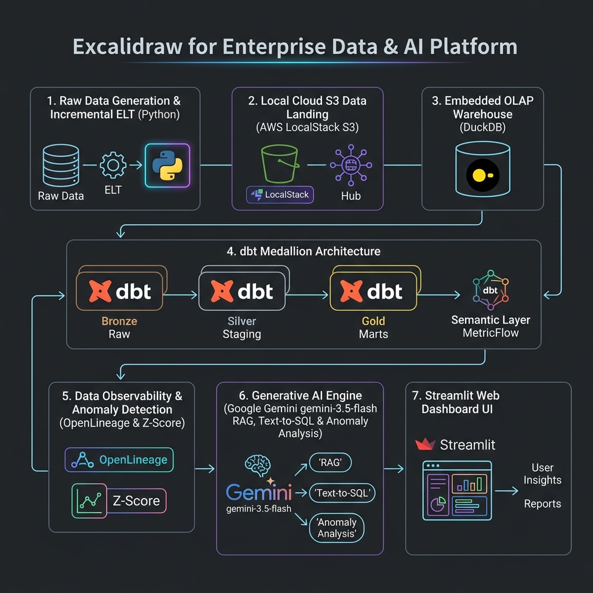
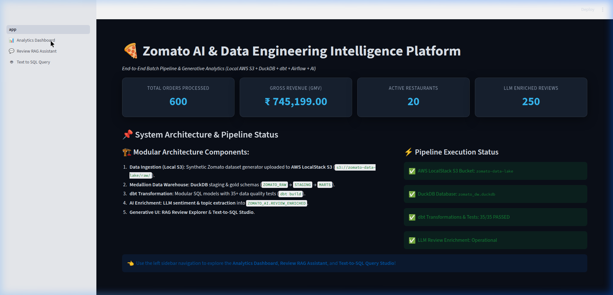
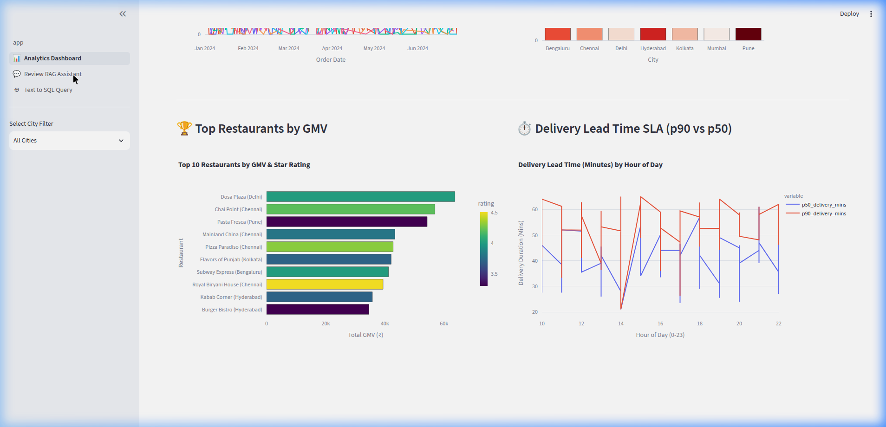
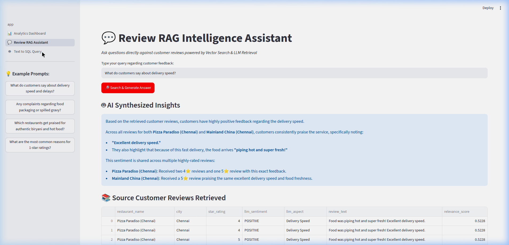
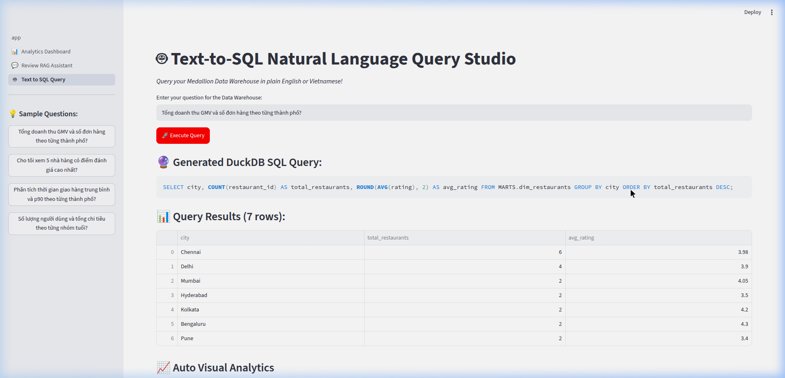
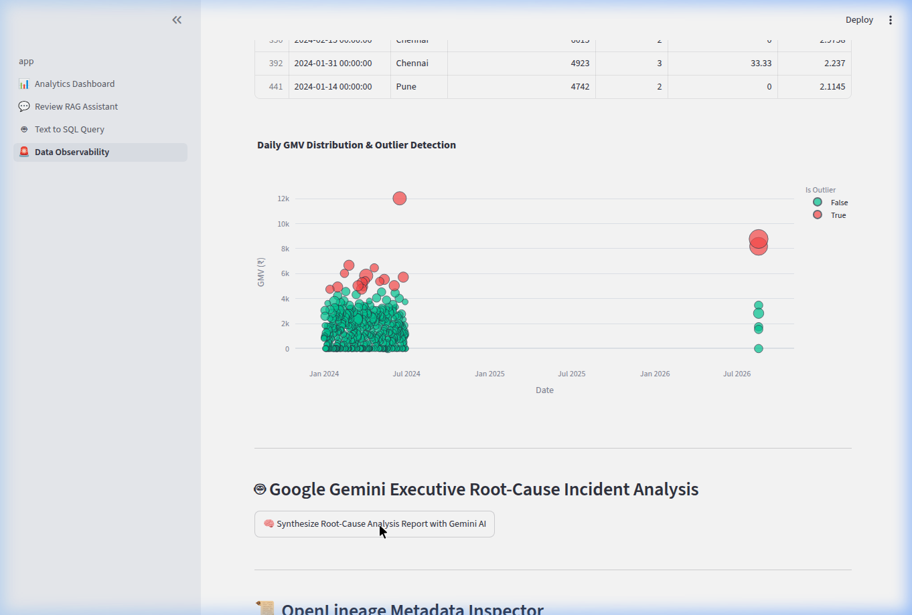
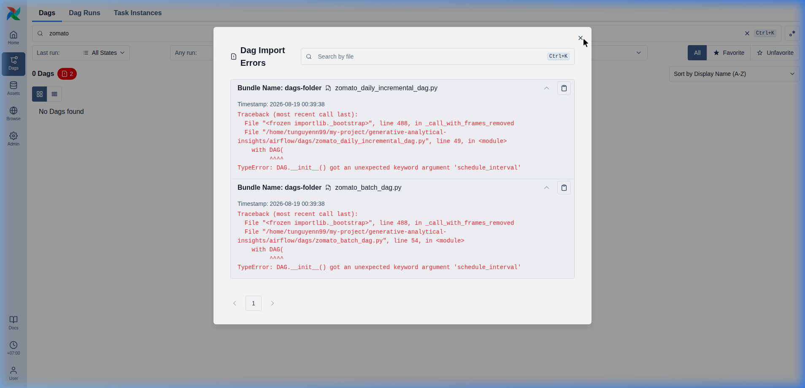

<div align="right">
  <a href="README.md">🇬🇧 English</a> | <b>🇻🇳 Tiếng Việt</b>
</div>

# 🍕 Zomato AI & Data Engineering Intelligence Platform

Nền tảng phân tích dữ liệu batch hiện đại và trí tuệ nhân tạo Generative AI end-to-end. Dự án được phát triển hoàn toàn ở môi trường Local tích hợp **AWS LocalStack S3**, **DuckDB Data Warehouse**, **dbt Medallion Architecture**, **Apache Airflow**, **Google Gemini AI (`gemini-3.5-flash`)**, **Pre-Commit / CI Quality Governance**, và ứng dụng web đa trang **Streamlit**.

---

## 📐 Sơ Đồ Kiến Trúc & Luồng Dữ Liệu (Chuẩn Excalidraw)



### 🔄 Quy Trình Tự Động Hóa End-to-End:
1. **Khởi Tạo Dữ Liệu & Daily Incremental**: Tự động sinh dữ liệu thô Zomato qua 7 bảng (`restaurants`, `users`, `food`, `menu`, `orders`, `order_items`, `reviews`) và chạy job phát sinh dữ liệu ngẫu nhiên hàng ngày (`scripts/generate_daily_incremental_data.py`).
2. **Lưu Trữ Dữ Liệu Thô (AWS LocalStack S3)**: Giả lập AWS S3 (`s3://zomato-data-lake/raw/`) chạy qua Docker Compose.
3. **Kho Dữ Liệu Phân Tích (DuckDB)**: Embedded OLAP Data Warehouse tốc độ cao (`data/warehouse/zomato_dw.duckdb`).
4. **Biến Đổi & Kiểm Duyệt Chất Lượng (dbt Core)**: Mô hình Medallion (Bronze Raw ➔ Silver Staging ➔ Gold Business Marts) đi kèm 35+ data quality assertions (`dbt test`) và tài liệu schema chuẩn (`docs.md`).
5. **Chuẩn Hóa Mã Nguồn & CI/CD**: Kiểm tra mã nguồn tự động qua Pre-commit hooks (**Black** Python formatter, **SQLFluff** SQL linter với dialect DuckDB) và GitHub Actions Workflows (`ci_pipeline.yml`, `daily_incremental_pipeline.yml`).
6. **Tầng Trí Tuệ Nhân Tạo (Google Gemini API - Free Tier)**: Phân tích cảm xúc đánh giá khách hàng, tìm kiếm vector RAG và chuyển đổi câu hỏi tự nhiên thành câu lệnh SQL (`gemini-3.5-flash`).
7. **Giám Sát Dữ Liệu & Lineage (Data Observability)**: Theo dõi sự kiện OpenLineage JSON, giám sát SLA độ tươi dữ liệu, phát hiện điểm bất thường Z-Score (`|z| > 2.0`) và tự động tổng hợp báo cáo Root-Cause bằng Gemini AI.
8. **Đóng Gói Containerization (Docker Compose)**: Khởi chạy 100% hạ tầng LocalStack S3 và Streamlit Web Platform với 1 lệnh đơn duy nhất `docker compose up -d`.

---

## 🖥️ Màn Hình Giao Diện Web

### 1. 🏠 Executive Overview & Pipeline Health

- **KPI Tổng Quan**: Tổng đơn hàng, Doanh thu Gross GMV, Nhà hàng đối tác, và số lượng đánh giá được AI làm giàu.
- **Trạng Thái Pipeline**: Kiểm tra kết nối thời gian thực tới LocalStack S3, DuckDB Warehouse, dbt Tests (35/35 PASSED), và Gemini LLM API.

---

### 2. 📊 BI Analytics Dashboard

- **Xu Hướng GMV Hàng Ngày**: Biểu đồ đường tương tác hiển thị doanh thu theo từng thành phố.
- **Tỷ Lệ Hủy Đơn**: Theo dõi phần trăm đơn hủy theo khu vực.
- **Top Nhà Hàng Theo GMV**: Xếp hạng nhà hàng doanh thu cao nhất.
- **Thời Gian Giao Hàng SLA**: So sánh thời gian giao trung vị (P50) và percentile 90 (P90) theo khung giờ trong ngày.

---

### 3. 💬 Review RAG Intelligence Assistant

- **Tìm Kiếm Vector & Tổng Hợp LLM**: Kết hợp TF-IDF similarity trên đánh giá khách hàng với **Google Gemini (`gemini-3.5-flash`)**.
- **Câu Trả Lời Minh Bạch**: Trích dẫn chính xác trích dẫn đánh giá, số sao và tên nhà hàng.

---

### 4. 🤖 Text-to-SQL Natural Language Query Studio

- **Truy Vấn Ngôn Ngữ Tự Nhiên sang SQL**: Chuyển đổi câu hỏi tiếng Anh/tiếng Việt thành câu lệnh SQL DuckDB (chế độ Read-only).
- **Trực Quan Hóa Tự Động**: Thực thi SQL trên schema `MARTS` và tự động vẽ biểu đồ cột Plotly.

---

### 5. 🚨 Data Observability & Gemini AI Root-Cause Analysis

- **Phát Hiện Điểm Dị Biệt Thống Kê**: Biểu đồ phân tán theo dõi doanh thu và tỷ lệ hủy đơn bất thường ($|Z\text{-score}| > 2.0$).
- **Tổng Hợp Báo Cáo Gemini AI**: Tự động sinh báo cáo nguyên nhân gốc và đề xuất khắc phục trực tiếp trên giao diện.

---

### 6. 🌀 Apache Airflow Orchestration UI

- **Lập Lịch Tự Động Airflow**: Giao diện trực quan cho 2 DAGs (`zomato_end_to_end_batch` và `zomato_daily_incremental_ingestion`).

---

## 🛠️ So Sánh Công Nghệ Sử Dụng

| Thành Phần Pipeline | Chuẩn Cloud Production | Môi Trường Local Production | Ưu Điểm & Lý Do Lựa Chọn |
| :--- | :--- | :--- | :--- |
| **Data Lake Storage** | AWS S3 (Cloud) | **AWS LocalStack S3** | Miễn phí 100%, tương thích hoàn toàn AWS S3 SDK boto3 |
| **Data Warehouse** | Snowflake / Redshift | **DuckDB** | Zero-setup, OLAP in-memory siêu tốc cho SQL analytical |
| **Engine Biến Đổi** | dbt Cloud / dbt-snowflake | **`dbt-duckdb`** | Mô hình hóa SQL Medallion, dbt test và tài liệu hóa tự động |
| **Chuẩn Hóa Mã Nguồn** | GitHub Actions / Pre-Commit | **Black + SQLFluff** | Tự động format Python và kiểm tra cú pháp SQL chuẩn |
| **Mô Hình Generative AI** | OpenAI GPT-4o | **Google Gemini (`gemini-3.5-flash`)** | **Free tier access**, 1M context window, phản hồi RAG siêu nhanh |
| **Điều Phối Data** | Managed Airflow (MWAA) | **Apache Airflow (DAGs)** | Lập lịch tự động định kỳ hàng ngày |
| **Giao Diện Phân Tích** | Metabase / Tableau | **Streamlit + Plotly** | Web App Python với giao diện Dark Mode cao cấp |

---

## 🏛️ Kiến Trúc Dữ Liệu Medallion (dbt Layers)

```
data/warehouse/zomato_dw.duckdb
 ├── ZOMATO_RAW (Bronze)       --> Nạp trực tiếp từ LocalStack S3 / CSVs
 ├── STAGING (Silver)          --> Chuẩn hóa kiểu dữ liệu, làm sạch (stg_restaurants, stg_orders,...)
 ├── MARTS (Gold)              --> Bảng phân tích kinh doanh (dim_restaurants, fct_orders, mart_daily_revenue,...)
 └── ZOMATO_AI (Enriched)      --> Gemini LLM sentiment & aspect analysis (REVIEW_ENRICHED)
```

---

## 🚀 Hướng Dẫn Chạy Dự Án

### 1. Khởi Động Hạ Tầng LocalStack S3
```bash
docker compose up -d localstack
python3 scripts/init_localstack_s3.py
```

### 2. Chạy Toàn Bộ Pipeline End-to-End
```bash
python3 scripts/run_pipeline.py
```

### 3. Mở Giao Diện Web Streamlit
```bash
streamlit run app/app.py
```
Truy cập web tại địa chỉ: **`http://localhost:8501`**
